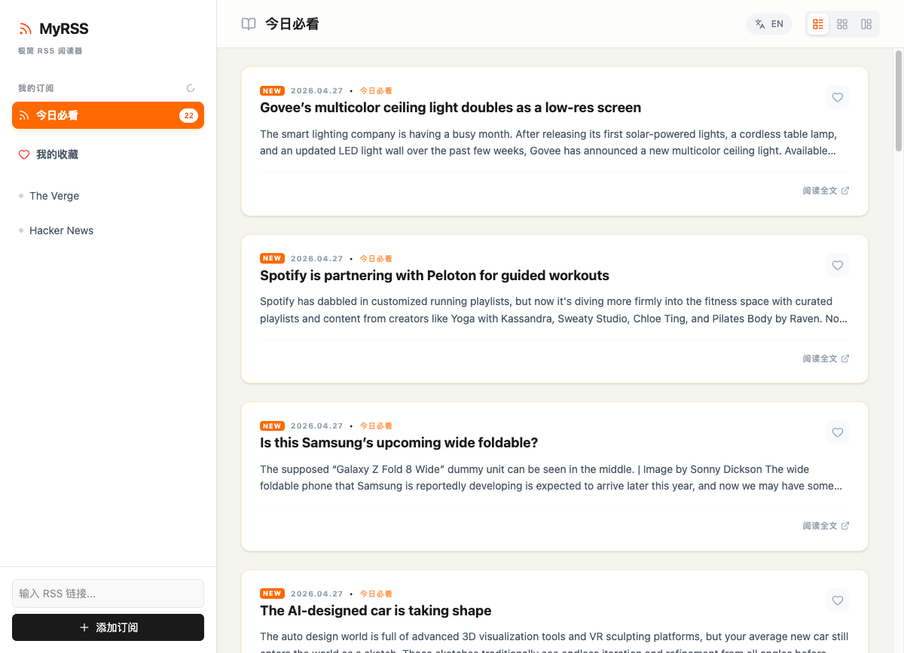

[中文](README_zh.md) | English

# MyRSS

A minimal RSS reader with multi-source subscriptions, daily must-read aggregation, bookmarks, and i18n support.



## Tech Stack

- **Frontend**: React 19 + TypeScript + Tailwind CSS 4 + Vite 6
- **Backend**: Express (dev proxy / RSS API)
- **Animation**: Motion
- **Dates**: date-fns

## Getting Started

1. Install dependencies:

   ```bash
   npm install
   ```

2. Start the dev server:

   ```bash
   npm run dev
   ```

3. Open `http://localhost:5173`

## Features

- Subscribe to multiple RSS feeds with one-click add/remove
- "Must Read" aggregates today's unread articles across all subscriptions
- Bookmark articles for later, persisted across sessions
- List / Grid / Card layout toggle
- English / Chinese UI toggle
- Data persisted to browser localStorage

## Project Structure

```
src/
├── App.tsx       # Main application component
├── main.tsx      # Entry point
└── index.css     # Tailwind + global styles
server.ts         # Express dev server (RSS proxy API)
```

## Build

```bash
npm run build   # Vite production build → dist/
npm run preview # Preview production build
```

## License

MIT
